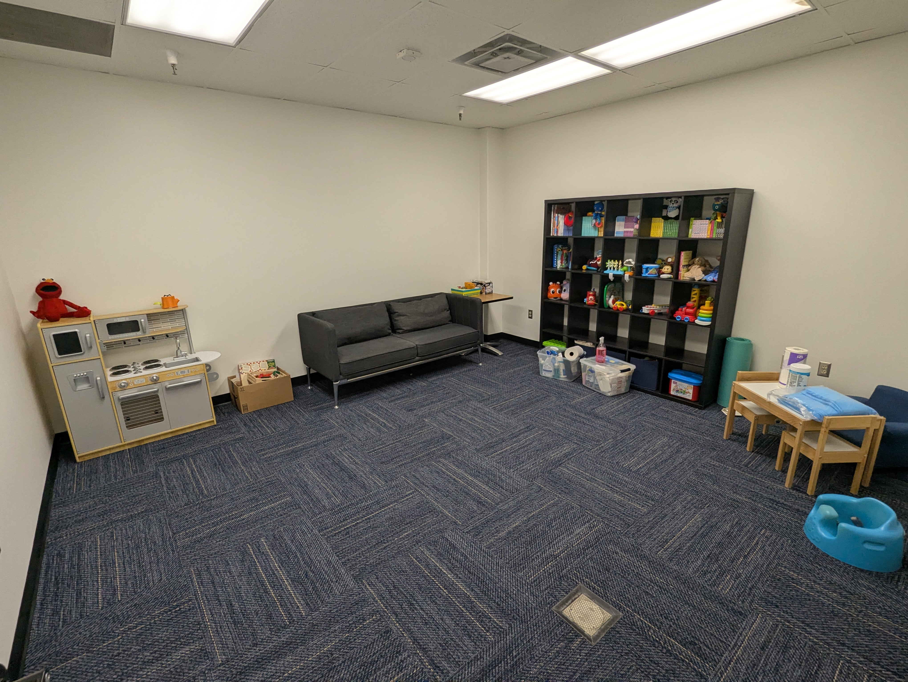
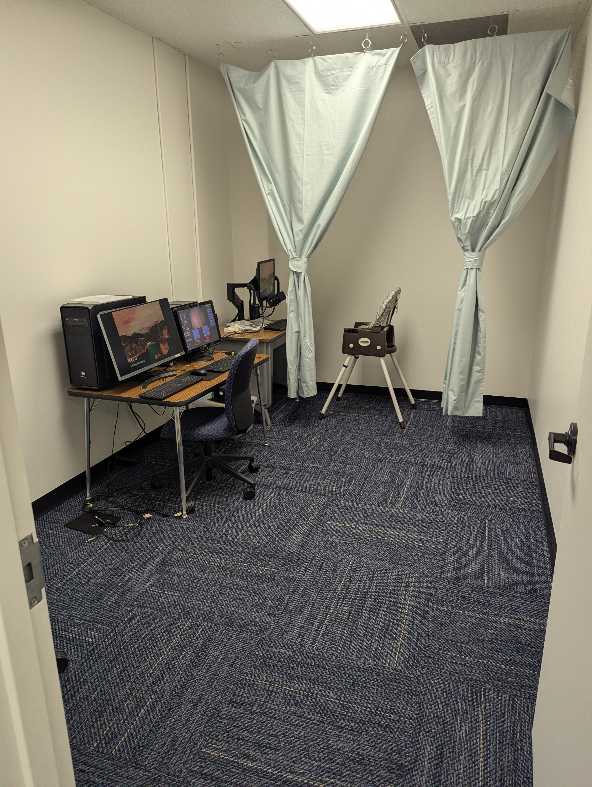

In February 2026, the Perception, Action, and Development Lab moved into a newly-renovated, larger lab space in the basement of Olmsted Hall, Room A0130. 

{width="100%" fig-align="left"}

{width="100%" fig-align="left"}

