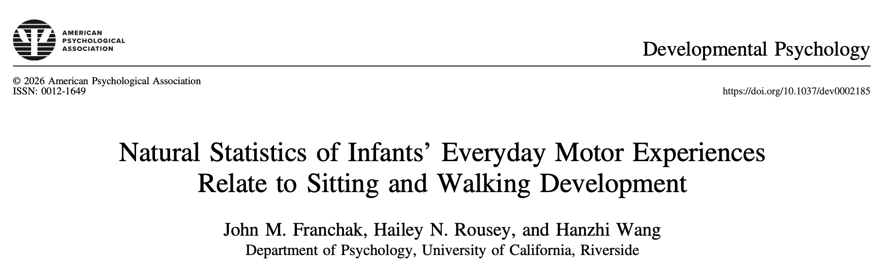

{width="100%" fig-align="right"}

A new article, "Natural statistics of infants’ everyday motor experiences relate to sitting and walking development" was accepted at *Developmental Psychology*. The article was authored by John Franchak, Hailey Rousey, and Hanzhi Wang. This was a fully reproducible manuscript, and the data and code required to compile the manuscript are available on [OSF](https://doi.org/10.17605/OSF.IO/WMGS4). A preprint is available [here](/publications/2026-Franchaketal-DevPsych.pdf).

### Abstract

The current study reports the natural statistics of everyday motor experiences, measured throughout the day using wearable inertial sensors. Using a large data set of infants’ real-time upright, sitting, prone, supine, and held experiences, we investigated how age and motor skill relate to the frequency and bout structure of body position. Our analyses replicated past survey and observational work by showing that older infants (11-14 months) spend more time sitting and upright compared with younger infants (4-7 months), and that the emergence of sitting and walking skills may contribute to these age differences. Furthermore, our analyses were novel in revealing that a larger share of younger infants’ bouts were longer—lasting several minutes and even over an hour. In contrast, older infants had a greater share of shorter bouts less than 1 minute long, suggesting they experience a greater mix of positions. Within older infants, bout duration distributions also varied according to walking skill. We discuss the importance of understanding the natural statistics of motor experiences at different timescales for characterizing infants’ opportunities for motor learning and perceptual-motor exploration in daily life.

### Public Significance
Infants’ everyday movement relates to how they practice motor skills and learn about the surrounding world. Using data collected from wearable movement sensors that recorded for up to 10 hours in the home, we found that older versus younger infants spend their time in different movement activities. Older infants sit and stand more and experience more variation in movements, which may relate to changes in how they learn.

