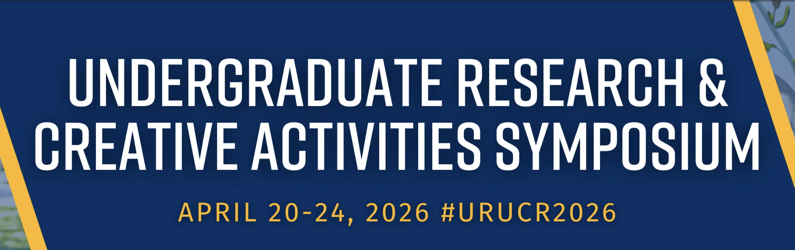

{width="75%" fig-align="center"}

Five PADLAB undergraduate researchers, Anna Medvedeva, Mark Shimizu, Rabyana Iqbal, Abigail Smith, and Nola Perefil, presented their work at the 20th Annual [UCR Undergraduate Research & Creative Activities Symposium](https://engage.ucr.edu/symposium), showcasing their projects and contributions over the academic year.

### Mark Shimizu

{width="100%" fig-align="center"}

### Rabyana Iqbal

{width="100%" fig-align="center"}

### Abigail Smith

{width="100%" fig-align="center"}

### Nola Perefil

{width="100%" fig-align="center"}
