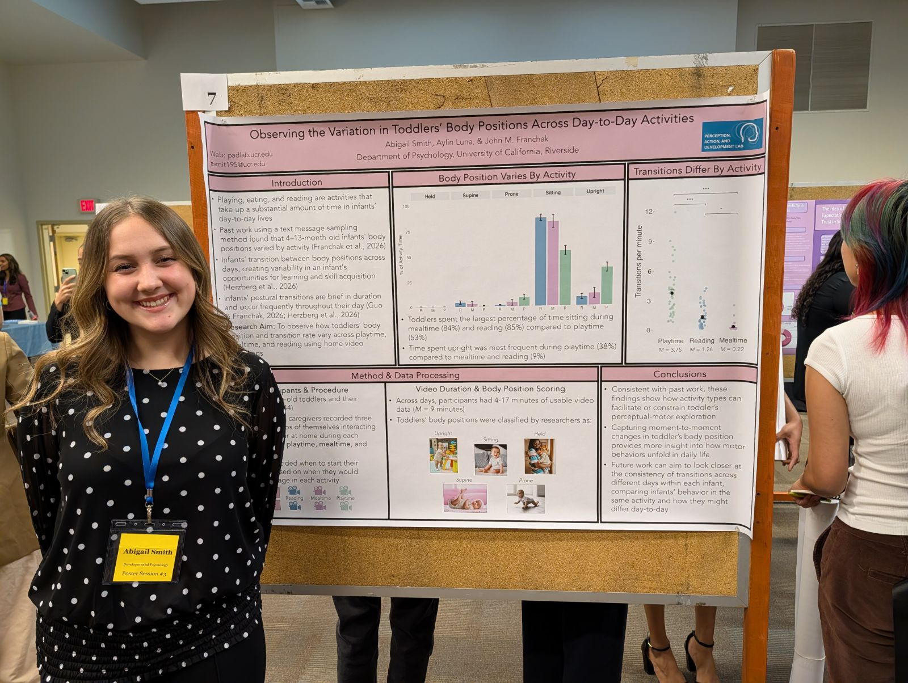

PADLAB was well-represented at the 8th Annual [UCR R'PSYC Undergraduate Psychology Research Conference](https://events.ucr.edu/event/rpsyc-2026-the-8th-annual-undergraduate-psychology-research-conference-presented-by-psi-chi) on May 18, 2026. In addition to showcasing the lab's research, PADLAB undergraduate research assistant Rabyana Iqbal was one of the conference co-chairs and lead organizers.

### Anna Medvedeva Wins Best Developmental Presentation Award
Anna Medvedeva was awarded the **Best Developmental Presentation Award** for her presentation on infant motor and language development.

{width="100%" fig-align="center"}

### Abigail Smith's poster
Abigail Smith presented a poster *Observing the variation in toddler's body positions across day-to-day activities*.

{width="100%" fig-align="center"}

### Nola Perifel's poster
Nola Perifel presented a poster, *The relationship between caregiver screen use and their responsiveness to infant needs*.

{width="100%" fig-align="center"}

### Dr. Franchak Delivers Keynote Address
Dr. John Franchak was the Keynote Speaker for the conference, presenting a talk on his undergraduate research journey and how it inspired current lab projects about embodied visual exploration.

{width="100%" fig-align="center"}

### PADLAB Team at R'PSYC 2026
Congratulations to all the presenters on their fantastic work and a very successful conference!

{width="100%" fig-align="center"}
