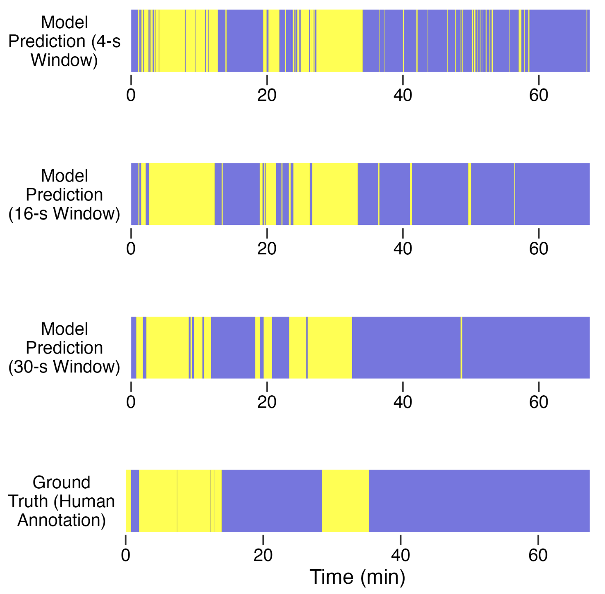

A new article, "Quantifying infants’ everyday restrained experiences in the home using wearable inertial sensors" was accepted at *Behavior Research Methods*. The article was authored by Hanzhi Wang, Hailey Rousey, and John Franchak. This was a fully reproducible manuscript, and the data and code required to compile the manuscript are available on [OSF](https://osf.io/a698g/overview?view_only=221d1f2bc8d34b5d9838354224d6da8f). A preprint is available [here](/publications/2026-Wangetal-BRM.pdf).

### Abstract

Physical restraint—including being held, carried, and restrained in devices—is a common feature of infants’ everyday lives. However, previous survey-based and video-based methods cannot simultaneously provide continuous, full-day accounts of infant restrained experiences. This study developed and validated a machine learning model to quantify infants’ restrained time moment- to-moment across the full day in the home environment using wearable sensor data. We used a dataset that includes 146 home-visit sessions from 66 infants, with 30 younger infants aged 4-7 months, and 36 older infants aged 11-14 months. We annotated infants’ restrained states in the first 1.5-hour video recordings of each session as ground truth labels. The supervised machine-learning model achieved high accuracy (89%) and substantial kappa agreement (κ = .73) compared with human-coded ground truth. The model presented a slight bias towards overestimating unrestrained periods compared to restrained periods, but the bias was mitigated when we used a longer data-aggregating window length. The model also showed convergent validity by corroborating prior studies that showed an age-related decrease in infants’ overall restrained time throughout the day. In short, the current study demonstrated the utility of using wearable sensors to quantify infants’ real-world restrained experiences, offering a new tool for studying how daily restraint influences early development.

{width="75%" fig-align="left"}

